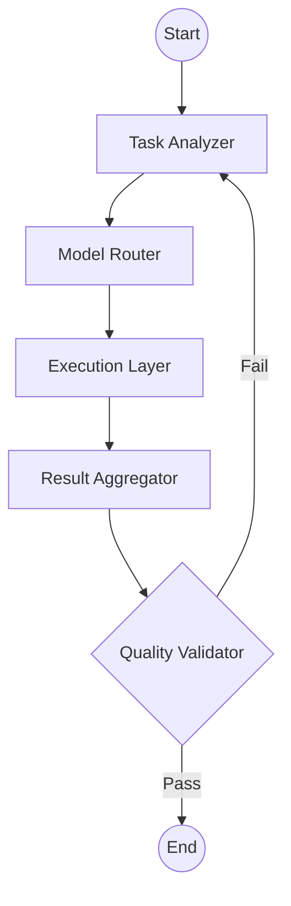

# AI Meta-Orchestrator: System Architecture

## 1. Overview
The AI Meta-Orchestrator is a modular system designed to handle complex user requests by decomposing them into manageable subtasks, routing each to the most appropriate AI model via LiteLLM, and synthesizing a validated final response using LangGraph.

## 2. Core Components

### 2.1. State Management (`State`)
The central state object tracked by LangGraph.
- `user_input`: Original request.
- `subtasks`: List of `SubTask` objects (description, status, assigned_model, result).
- `final_output`: The synthesized result.
- `metadata`: Routing decisions, costs, and execution logs.

### 2.2. Task Analyzer & Decomposer (`AnalyzerNode`)
- **Input**: `user_input`.
- **Logic**: Uses a high-reasoning model (e.g., GPT-4o) to break down the input into a structured list of subtasks.
- **Output**: Populates `subtasks`.

### 2.3. Model Router (`RouterNode`)
- **Input**: `subtasks`.
- **Logic**: (Stage 1: Manual) Assigns pre-defined models to subtask types (e.g., Claude for code, Gemini for search).
- **Logic**: (Stage 2: Dynamic) Queries the `Capability Registry` to match subtask requirements (latency, cost, capability) with model metadata.
- **Output**: Updates `subtasks` with `assigned_model`.

### 2.4. Execution Layer (`ExecutorNode`)
- **Input**: `subtasks` with `assigned_model`.
- **Logic**: Iterates through subtasks (or executes in parallel) using `LiteLLM` to call the respective model APIs.
- **Output**: Updates `subtasks` with `result`.

### 2.5. Result Aggregator (`AggregatorNode`)
- **Input**: `subtasks` results.
- **Logic**: Combines subtask outputs into a coherent final response.
- **Output**: Sets `final_output`.

### 2.6. Quality Validator (`ValidatorNode`)
- **Input**: `final_output` and `user_input`.
- **Logic**: Checks for consistency, completeness, and correctness. If failed, it can trigger a loop back to the Analyzer or Executor.
- **Output**: Finalized state or retry signal.

## 3. Workflow Diagram (LangGraph)

## 4. Technology Stack
- **Orchestration**: LangGraph
- **Model Abstraction**: LiteLLM
- **Reasoning/Logic**: Pydantic for schemas
- **Communication**: Python 3.10+
